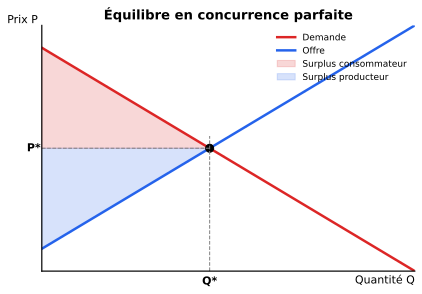
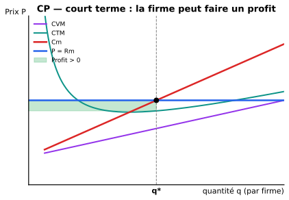
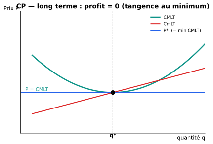

::: {.callout-tip}
## Ce chapitre en 1 ligne
En **concurrence parfaite**, chaque firme est « petite » et **subit le prix** du marché ; à long terme, la libre entrée fait que **le profit économique tend vers zéro**.
:::

## Les 5 hypothèses de la concurrence parfaite

| Hypothèse | Conséquence |
|---|---|
| 1. **Atomicité** — beaucoup d'acheteurs et de vendeurs | Personne n'influence le prix |
| 2. **Homogénéité du produit** | Les biens sont parfaitement substituables |
| 3. **Libre entrée / sortie** | Pas de barrières — entrée si profit > 0, sortie si profit < 0 |
| 4. **Information parfaite** | Tout le monde connaît les prix et les qualités |
| 5. **Mobilité parfaite des facteurs** | Capital et travail vont là où ils sont le mieux rémunérés |

::: {.callout-tip collapse="true"}
## En simple
La CP, c'est le marché « du manuel » : **tellement de vendeurs et d'acheteurs, tellement transparent, tellement libre** que personne n'a de pouvoir individuel. Chaque firme est un **price-taker** (preneuse de prix) : elle subit le prix du marché et choisit juste quelle quantité produire à ce prix.
:::

## Équilibre du marché (offre et demande)

{width=80%}

Le **prix d'équilibre** $P^*$ et la **quantité d'équilibre** $Q^*$ sont à l'intersection des courbes d'offre et de demande agrégées.

## La firme en CP — court terme

Au niveau de la **firme individuelle**, le prix $P$ est **donné** par le marché. La firme choisit $q$ pour maximiser son profit.

::: {.callout-important}
## Condition fondamentale
$$\boxed{\ P = Rm = Cm\ }$$

Comme la firme est preneuse de prix, **$P = Rm$** (chaque unité vendue rapporte le prix). On maximise alors le profit en posant $Rm = Cm$, soit $P = Cm$.
:::

{width=80%}

### Le profit à court terme

$$\pi(q) = (P - CTM(q)) \cdot q$$

- Si $P > CTM(q^*)$ → **profit > 0** (la firme gagne de l'argent).
- Si $P = CTM(q^*)$ → **profit = 0** (juste couvre ses coûts).
- Si $P < CTM(q^*)$ mais $P > CVM(q^*)$ → **perte**, mais on **continue** (on couvre au moins le variable).
- Si $P < CVM(q^*)$ → **on arrête** (on perd plus en produisant qu'en fermant).

::: {.callout-warning}
## Le seuil de fermeture (Q très important pour l'examen)
À court terme : **la firme arrête de produire si $P < CVM$** (coût variable moyen).

À long terme : **la firme sort si $P < CMLT$** (coût moyen de long terme).
:::

::: {.callout-tip collapse="true"}
## En simple : pourquoi continuer en perte à court terme ?
Imagine que tu as loué un local pour un an (coût fixe = loyer que tu paies de toute façon). Si tes recettes couvrent au moins **les ingrédients et les salaires** (coût variable), tu continues — tu perds moins qu'en fermant (où tu paies le loyer pour rien).
:::

## La firme en CP — long terme

À **long terme**, la libre entrée et sortie joue à plein.

- Si la branche fait des **profits > 0** → de nouvelles firmes entrent → l'offre augmente → le prix **baisse** jusqu'à ce que le profit s'annule.
- Si la branche fait des **pertes** → des firmes sortent → l'offre diminue → le prix **monte** jusqu'à ce que les pertes s'annulent.

{width=80%}

::: {.callout-important}
## Équilibre de long terme en CP
$$\boxed{\ P^* = \min(CMLT)\ }$$

et chaque firme produit $q^*$ qui correspond à ce minimum.
:::

### Le seuil de sortie (long terme)

Le **seuil de sortie** est la quantité où $CMLT$ est minimal :
$$\dfrac{d\, CMLT(q)}{dq} = 0$$

::: {.callout-tip collapse="true"}
## Mini-exemple
$CT(x) = 5x^3 - 10x^2 + 8x + 20$

- Coût fixe : 20 (le terme constant). Coût variable : $CV(x) = 5x^3 - 10x^2 + 8x$.
- $CVM(x) = CV/x = 5x^2 - 10x + 8$
- $dCVM/dx = 10x - 10 = 0 \Rightarrow x = 1$.
- → **Seuil de sortie : $x = 1$**.
:::

## Conclusion : la concurrence parfaite et l'efficience

À l'équilibre de long terme, la CP est **efficace au sens de Pareto** :

- **Efficience allocative** : $P = Cm$ → la dernière unité produite est exactement « ce que les consommateurs sont prêts à payer pour la coût de la produire ».
- **Efficience productive** : production au minimum du CMLT → coût unitaire le plus bas possible.
- **Pas de perte sèche** (deadweight loss = 0).

::: {.callout-note}
## Récapitulatif Ch.1
| Court terme | Long terme |
|---|---|
| $P = Cm$ pour max profit | $P = \min(CMLT)$ |
| Profit peut être > 0, = 0 ou < 0 | Profit = 0 (entrée/sortie) |
| Arrêt si $P < CVM$ | Sortie si $P < CMLT$ |
| Q dépend de Cm | Production efficiente |
:::
