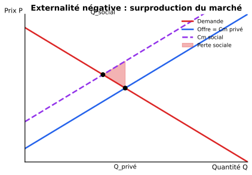

::: {.callout-tip}
## Ce chapitre en 1 ligne
Dans la réalité, les hypothèses de la CP sont rarement vérifiées ; il en résulte des **défaillances de marché** (asymétrie d'information, externalités, biens publics, rendements croissants) qui produisent des résultats **inefficients**.
:::

## 1. Asymétrie d'information

Une partie connaît mieux que l'autre la qualité (ou les actions) en jeu.

### Sélection adverse (avant la transaction)

L'acheteur **ne peut pas distinguer** les bonnes des mauvaises qualités → le prix s'aligne sur la qualité moyenne → les vendeurs de bonne qualité se retirent → la qualité moyenne baisse → le marché s'effondre.

::: {.callout-tip collapse="true"}
## En simple : « le marché des tacots » (Akerlof, 1970)
Tu vends une voiture d'occasion (excellente, 10'000). L'acheteur ne sait pas si c'est un « tacot » (3'000) ou une « bonne » (10'000). Il propose un prix moyen (6'500). Tu refuses. Seuls les tacots restent → le marché disparaît.
:::

### Aléa moral (après la transaction)

Une fois assuré / protégé, l'individu **change de comportement** (devient moins prudent).

::: {.callout-tip collapse="true"}
## En simple
Tu loues une voiture **avec assurance tous risques très chère**. Tu la conduis moins prudemment que ta propre voiture — c'est l'**aléa moral**. L'assurance est chère justement parce que l'assureur sait que tu vas être moins prudent.
:::

## 2. Externalités

L'activité d'un agent **affecte un autre agent** sans passer par le marché (pas de prix).

| Type | Définition | Exemple |
|---|---|---|
| **Négative** | Coût imposé à autrui | Pollution d'une usine |
| **Positive** | Bénéfice donné à autrui | Vaccination, ruche pour le verger voisin |

{width=80%}

::: {.callout-important}
## Conséquence
Avec une externalité **négative**, le marché produit **trop** (l'offre intègre seulement le coût privé, pas le coût social).

Avec une externalité **positive**, le marché produit **trop peu**.
:::

**Solutions :** taxes pigouviennes (faire payer le coût social), subventions, droits de propriété échangeables, réglementation, négociation à la Coase (si coûts de transaction faibles).

## 3. Biens publics

Un bien est **public pur** s'il est :

| Propriété | Définition | Exemple |
|---|---|---|
| **Non-rival** | Ma consommation ne réduit pas la tienne | Phare, défense nationale, feux d'artifice |
| **Non-exclusif** | On ne peut pas empêcher quelqu'un d'en profiter | Air pur, parc public |

::: {.callout-tip collapse="true"}
## En simple
Si je regarde un feu d'artifice, ça n'empêche personne d'autre de le voir (**non-rival**) et personne ne peut me chasser pour m'empêcher de regarder (**non-exclusif**).
:::

### Le problème du passager clandestin (free-rider)

Chacun a intérêt à **laisser les autres payer** pour le bien public et à en profiter gratuitement → le marché privé en produit **trop peu**, voire pas du tout → l'État doit financer.

| | Rival | Non-rival |
|---|---|---|
| **Exclusif** | Bien privé (pomme) | Bien de club (Netflix) |
| **Non-exclusif** | Bien commun (poissons en mer) | **Bien public pur** (défense) |

## 4. Rendements croissants

Quand les coûts moyens **diminuent quand la quantité augmente** (économies d'échelle), une seule grande firme est plus efficace que plusieurs petites → **monopole naturel** (voir Ch.3).

::: {.callout-tip collapse="true"}
## En simple
Construire un réseau ferroviaire ou une centrale électrique coûte énormément en **coûts fixes**. Plus tu produis, plus tu **étales** ces coûts fixes → coût par unité plus bas. Avoir deux réseaux parallèles serait absurde — un seul est plus efficient. C'est ce qu'on appelle un **monopole naturel**.
:::

## Récapitulatif des 4 défaillances

| Défaillance | Cause | Effet sur le marché |
|---|---|---|
| Asymétrie d'info | L'une des parties en sait plus | Sélection adverse / aléa moral |
| Externalité | Effet hors-marché | Sur- ou sous-production |
| Bien public | Non-rivalité + non-exclusion | Sous-production (free-rider) |
| Rendements croissants | $CTM$ décroissant | Monopole naturel |

::: {.callout-warning}
## Pour l'examen
Sache **distinguer aléa moral et sélection adverse** — c'est un grand classique :

- **Avant** la transaction (qualité cachée) → sélection adverse
- **Après** la transaction (comportement caché) → aléa moral

Et reconnaître les **4 propriétés** d'un bien : rival/non-rival, exclusif/non-exclusif → identifier bien privé, bien de club, bien commun, bien public.
:::
