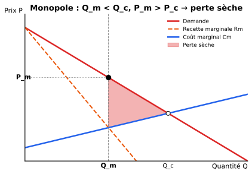
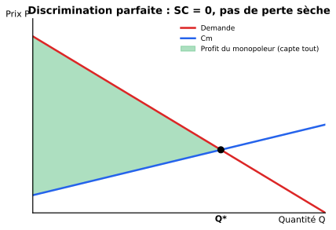
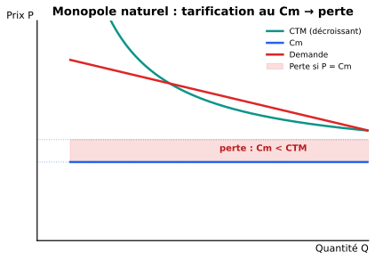

::: {.callout-tip}
## Ce chapitre en 1 ligne
Le **monopole** (vendeur unique) **restreint la quantité** pour faire monter le prix → quantité plus faible et prix plus élevé qu'en CP, ce qui crée une **perte sèche** sauf en cas de discrimination parfaite.
:::

## 1. Données de base — qu'est-ce qu'un monopole ?

Un **monopole** = **une seule firme** vend un produit pour lequel il n'existe pas de **substitut proche**, et l'entrée est bloquée par des **barrières**.

### Sources des barrières à l'entrée

| Type | Exemple |
|---|---|
| **Légales** | Brevets, licences, monopoles d'État |
| **Économiques (naturelles)** | Économies d'échelle, contrôle d'une ressource rare |
| **Stratégiques** | Capacité excédentaire, dumping, lock-in clients |

::: {.callout-tip collapse="true"}
## En simple
Si tu es la **seule** entreprise sur ton marché et que **personne ne peut entrer** (parce que t'as un brevet, ou parce que ça coûte des milliards pour démarrer), tu es en **monopole**. Tu n'es pas obligé de subir le prix — tu le **choisis** (mais à condition d'accepter une quantité plus faible).
:::

## 2. Monopole non discriminant

La firme **ne peut pas** faire payer des prix différents → un **seul prix** pour tous.

### La règle d'or : Rm = Cm

::: {.callout-important}
## Condition de maximisation du profit
$$\boxed{\ Rm(q) = Cm(q)\ }$$

Attention : ici $Rm \neq P$ ! La firme monopolistique fait face à la **demande de marché entière**, donc :

$$Rm(q) = P(q) + q \cdot P'(q)$$

Comme $P'(q) < 0$ (la demande est décroissante), on a **toujours $Rm < P$**.
:::

{width=80%}

::: {.callout-tip collapse="true"}
## Astuce : si la demande est linéaire $P = a - bQ$
Alors $Rm = a - 2bQ$ — **la pente de $Rm$ est le double de celle de $P$** (et même ordonnée à l'origine $a$).

C'est l'astuce la plus utile pour les exercices.
:::

### Conséquences vs concurrence parfaite

| | Concurrence | Monopole |
|---|---|---|
| Quantité | $Q_c$ | $Q_m < Q_c$ |
| Prix | $P_c = Cm$ | $P_m > P_c$ |
| Profit | 0 (LT) | > 0 (souvent positif même LT) |
| Surplus consommateur | élevé | réduit |
| Perte sèche | 0 | **> 0** |

## 3. Monopole discriminant

Le monopoleur fait payer **des prix différents** à différents acheteurs ou pour différentes quantités.

### Les 3 degrés (Pigou)

| Degré | Description | Exemple |
|---|---|---|
| **1er** | **Parfait** : chaque unité au prix max que l'acheteur est prêt à payer | Vente aux enchères individuelle |
| **2e** | Prix selon la **quantité** achetée | Tarifs dégressifs, abonnement vs unitaire |
| **3e** | Prix selon le **groupe** d'acheteurs (élasticité différente) | Tarif étudiant, heures pleines/creuses, prix par pays |

### Discrimination parfaite (1er degré)

{width=80%}

Le monopoleur **produit jusqu'à $P = Cm$** (comme en CP !), mais **capte tout le surplus du consommateur**.

::: {.callout-important}
## Résultat surprenant
La discrimination parfaite est **efficiente** (pas de perte sèche, on produit la quantité « concurrentielle ») — mais **injuste** : tout le surplus va au monopoleur, rien au consommateur.
:::

### Discrimination de 3e degré (par groupes)

Règle : **prix plus élevé là où la demande est moins élastique**.

$$\frac{P_1}{P_2} = \frac{1 + 1/\varepsilon_2}{1 + 1/\varepsilon_1}$$

::: {.callout-tip collapse="true"}
## En simple
- Un groupe a peu de substituts → **demande inélastique** → on peut faire payer cher.
- Un groupe a beaucoup d'alternatives → **demande élastique** → si on monte le prix, il fuit.

Exemple : électricité **plus chère en journée** (consommation industrielle, peu élastique) **moins chère la nuit** (résidentiel, plus élastique → on incite à reporter).
:::

## 4. Comparaison monopole — concurrence parfaite

Pour une demande linéaire $P = a - bQ$ et un coût marginal constant $c$ :

| Variable | CP | Monopole |
|---|---|---|
| Quantité | $Q_c = (a - c)/b$ | $Q_m = (a - c)/(2b) = Q_c / 2$ |
| Prix | $P_c = c$ | $P_m = (a + c)/2$ |
| Profit | 0 (LT) | $(a-c)^2/(4b) > 0$ |
| Surplus total | maximal | inférieur ($\to$ perte sèche) |

::: {.callout-warning}
## À retenir
- Monopole = **moitié de la quantité concurrentielle** (cas linéaire) → **prix beaucoup plus élevé**.
- **Perte sèche** = aire entre la demande et le $Cm$ sur $[Q_m, Q_c]$.
:::

## 5. Le monopole naturel

Quand le **CTM décroît** sur toute la zone de demande, **une seule firme** produit moins cher que plusieurs → c'est efficient d'avoir un monopole.

{width=80%}

::: {.callout-important}
## Le dilemme du monopole naturel
- **Tarification au prix $P = Cm$** (idéale en CP) → comme $Cm < CTM$ (puisque $CTM$ décroît), la firme **produit à perte** → faillite ou subvention.
- **Tarification au prix $P = CTM$** → profit nul, mais quantité < quantité socialement optimale.

→ Souvent : **réglementation** + **subvention** + **droits exclusifs** (eau, gaz, rail…).
:::

### Économies d'échelle multi-produits

Pour un monopole naturel **multi-produit**, les économies d'échelle ne sont **ni nécessaires ni suffisantes** — il faut la **sous-additivité** des coûts (économies de gamme).

## 6. Le monopsone

Le **monopsone** = **un seul acheteur** face à de nombreux vendeurs. Symétrique du monopole.

| Monopole (vendeur unique) | Monopsone (acheteur unique) |
|---|---|
| Fait monter le prix | Fait baisser le prix |
| Quantité < CP | Quantité < CP |
| Règle : $Rm = Cm$ | Règle : valeur marginale = $C_{marginal\ du\ facteur}$ |
| Pouvoir de vente | Pouvoir d'achat |

::: {.callout-tip collapse="true"}
## En simple
Si tu es la **seule entreprise qui embauche** dans ta région, tu peux faire baisser les salaires (les travailleurs n'ont pas d'autre employeur). C'est un **monopsone sur le marché du travail**.

Exemple récent : géants du tech qui embauchent presque tous les data scientists d'une région.
:::

::: {.callout-note}
## Récapitulatif Ch.3
- Monopole non-discriminant : **$Rm = Cm$**, $Q$ et $P$ moins favorables qu'en CP, perte sèche.
- Monopole discriminant parfait : produit comme CP **mais** capte tout le surplus.
- Discrimination 3e degré : prix plus élevé là où la demande est inélastique.
- Monopole naturel : $CTM$ décroissant → un seul producteur est efficient mais pose un dilemme tarifaire.
- Monopsone : symétrique du monopole côté demande de facteurs.
:::
