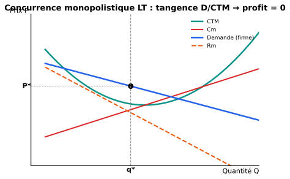

::: {.callout-tip}
## Ce chapitre en 1 ligne
**Beaucoup de firmes** vendent des produits **différenciés** (proches mais pas identiques) → chacune a un mini-monopole sur sa version, mais la **libre entrée** ramène le profit à zéro à long terme — au prix d'une **surcapacité**.
:::

## Concept-clé : différenciation des produits

Le marché ressemble à la CP (beaucoup de firmes, libre entrée) mais les **produits ne sont plus identiques**. Chaque firme propose sa propre version : couleur, marque, design, emplacement, service…

::: {.callout-tip collapse="true"}
## En simple
Pense à **toutes les marques de shampooing** : Tresemmé, Garnier, Pantene, Schwarzkopf, marque blanche du supermarché… Beaucoup de marques (≈ concurrence) mais chacune **fidélise** un peu ses clients (≈ mini-monopole). Si Pantene augmente son prix de 50 centimes, certains clients restent par habitude — mais pas tous.
:::

| Critère | Concurrence parfaite | Concurrence monopolistique | Monopole |
|---|---|---|---|
| Nombre de firmes | Très nombreuses | Nombreuses | Une seule |
| Produit | Homogène | **Différencié** | Unique |
| Entrée | Libre | **Libre** | Bloquée |
| Pouvoir de marché | Aucun | **Limité** | Total |
| Courbe de demande | Horizontale | **Décroissante** (peu pentue) | Décroissante (de marché) |

## Comportement de la firme

Chaque firme fait face à une **demande décroissante** (mais très élastique, vu les substituts). Elle se comporte donc comme un **mini-monopole** :

$$Rm(q) = Cm(q) \quad \text{pour max profit}$$

→ elle choisit $q^*$ et $P^*$ selon sa propre demande, exactement comme un monopole.

## Court terme vs long terme

### Court terme

La firme peut faire un **profit > 0** (comme un monopole). Mais ce profit attire de **nouveaux entrants** (libre entrée).

### Long terme : ajustement et tangence

Quand de nouvelles firmes entrent :

- La demande adressée à **chaque firme se réduit** (le marché se partage).
- La courbe de demande de la firme se déplace **vers la gauche**.
- L'entrée continue tant qu'il reste un profit > 0.
- À l'équilibre LT, la demande est **tangente au $CTM$** au point optimal → **profit = 0**.

{width=80%}

::: {.callout-important}
## Équilibre LT en concurrence monopolistique
$$\boxed{\ Rm = Cm \quad \text{et} \quad P = CTM\ }$$

(profit nul, mais ce **n'est pas** au minimum du CTM comme en CP)
:::

## Efficience de la concurrence monopolistique

C'est un cas **mixte** :

| Critère | Évaluation |
|---|---|
| Profit LT | = 0 ✓ (comme CP) |
| Production au min(CTM) | **Non** ✗ (à la gauche du min) |
| $P = Cm$ | **Non** ✗ ($P > Cm$, donc perte sèche modérée) |
| Variété de produits | **Oui** ✓ (consommateurs aiment le choix) |

### La « surcapacité »

Comme la production se fait à gauche du min(CTM), chaque firme produit **moins que sa taille optimale** → si elles étaient moins nombreuses et plus grandes, elles produiraient à coût moyen plus bas.

::: {.callout-tip collapse="true"}
## En simple : le « prix de la variété »
On a beaucoup de marques de café, chacune avec son petit côté unique. Le revers : aucune ne tourne à son **plein régime**. Si on avait juste 2 super-marques au lieu de 20, le café serait moins cher — mais on n'aurait plus le choix.

C'est un **arbitrage** : un peu d'inefficience contre la **variété**.
:::

## Effet d'une campagne publicitaire

Une campagne publicitaire renforce la **différenciation** perçue :

- La demande adressée à la firme devient **moins élastique** (les clients ont du mal à voir les substituts comme équivalents).
- La courbe de demande **se déplace** parfois aussi vers la droite (plus de demande).

::: {.callout-warning}
## Effet sur l'élasticité
Plus la firme se différencie (pub, image), **plus son élasticité-prix de la demande diminue en valeur absolue** → elle peut augmenter le prix sans perdre trop de clients.
:::

::: {.callout-note}
## Récapitulatif Ch.4
- Beaucoup de firmes, produits **différenciés**, libre entrée.
- À court terme : profit possible (mini-monopole).
- À long terme : **entrée jusqu'à profit = 0** → tangence demande/CTM.
- Inefficience modérée : **surcapacité** (production < min CTM) et $P > Cm$.
- En contrepartie : la **variété** que les consommateurs apprécient.
- Une **campagne publicitaire** réduit l'élasticité (en valeur absolue) → plus de pouvoir de marché.
:::
