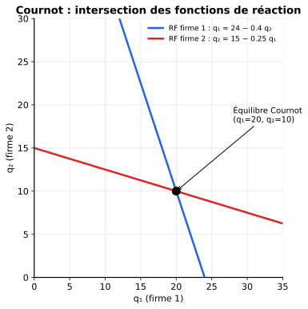
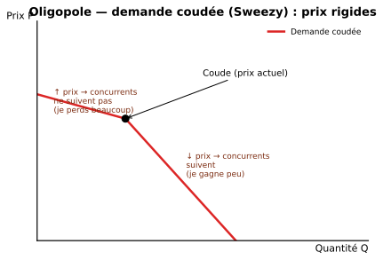
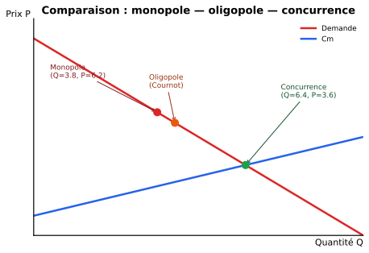

::: {.callout-tip}
## Ce chapitre en 1 ligne
**Quelques firmes** se partagent le marché ; chaque décision dépend de **ce que font les autres** → on raisonne en **modèles stratégiques** (Cournot, Stackelberg, Bertrand) avec des résultats très différents selon ce qui est choisi (quantité, prix, simultanément ou séquentiellement).
:::

## Caractéristiques

| Trait | Description |
|---|---|
| **Petit nombre** de firmes | 2 (duopole), 3, 4… typiquement |
| **Interdépendance stratégique** | La décision d'une firme **dépend** de celle des autres |
| **Barrières à l'entrée** | Économies d'échelle, brevets, capital élevé, marques |
| **Produits homogènes ou différenciés** | Selon les marchés |

::: {.callout-tip collapse="true"}
## En simple
En oligopole, **tout le monde se regarde**. Pepsi baisse ses prix ? Coca y pense aussi. Boeing lance un nouvel avion ? Airbus en lance un en réponse. C'est de la **stratégie**, pas juste de la maximisation isolée — d'où le besoin de la **théorie des jeux** (Ch.6).
:::

## Les trois modèles classiques

| Modèle | Choix | Comment ? | Résultat (prix) |
|---|---|---|---|
| **Cournot** | Quantité | **Simultanément** | Intermédiaire |
| **Stackelberg** | Quantité | **Séquentiellement** (un leader, un suiveur) | Plus bas que Cournot |
| **Bertrand** | **Prix** | Simultanément | $P = Cm$ (concurrentiel !) |

## 1. Modèle de Cournot (quantités, simultané)

Chaque firme choisit **sa quantité** en supposant celle de l'autre **fixée**.

### Construction des fonctions de réaction

**Démarche générale** pour une firme :

1. Écrire le **profit** $\pi_i = P(Q) \cdot q_i - C_i(q_i)$ avec $Q = q_1 + q_2$.
2. Dériver par rapport à $q_i$ (en supposant $q_j$ donné) et poser $= 0$.
3. On obtient la **fonction de réaction** $q_i = R_i(q_j)$.

**Équilibre de Cournot-Nash :** intersection des deux fonctions de réaction.

{width=70%}

::: {.callout-tip collapse="true"}
## Mini-exemple détaillé
Demande inverse : $P = 60 - Q$ où $Q = q_1 + q_2$. Coûts : $C_1 = q_1^2/4$, $C_2 = q_2^2$.

**Firme 1 :** $\pi_1 = (60 - q_1 - q_2)q_1 - q_1^2/4$
$$\dfrac{d\pi_1}{dq_1} = 60 - 2q_1 - q_2 - q_1/2 = 60 - (5/2)q_1 - q_2 = 0$$
$$\Rightarrow q_1 = (60 - q_2) \cdot 2/5 = 24 - 0.4\,q_2 \quad \text{(fonction de réaction 1)}$$

**Firme 2 :** $\pi_2 = (60 - q_1 - q_2)q_2 - q_2^2$
$$\dfrac{d\pi_2}{dq_2} = 60 - q_1 - 4q_2 = 0 \Rightarrow q_2 = 15 - 0.25\,q_1$$

**Équilibre :** substituer dans $q_1 = 24 - 0.4(15 - 0.25 q_1) = 18 + 0.1 q_1$
$$0.9\, q_1 = 18 \Rightarrow q_1 = 20,\ q_2 = 10$$
:::

## 2. Modèle de Stackelberg (quantités, séquentiel)

Une firme (**leader**) choisit sa quantité **en premier**, l'autre (**suiveur**) réagit. Le leader **anticipe la réaction du suiveur**.

### Démarche

1. Calculer la **fonction de réaction du suiveur** (comme en Cournot).
2. La **substituer** dans le profit du leader.
3. Maximiser le profit du leader par rapport à sa propre quantité.

::: {.callout-tip collapse="true"}
## Suite de l'exemple — si la firme 2 est leader
Fonction de réaction de la firme 1 (suiveur) : $q_1 = 24 - 0.4 q_2$.

Profit de la firme 2 (anticipe la réaction de 1) :
$$\pi_2 = (60 - q_1 - q_2)q_2 - q_2^2 = (60 - (24 - 0.4q_2) - q_2)q_2 - q_2^2 = (36 - 0.6q_2)q_2 - q_2^2$$
$$\dfrac{d\pi_2}{dq_2} = 36 - 1.2 q_2 - 2 q_2 = 36 - 3.2 q_2 = 0 \Rightarrow q_2 = 11.25$$
$$q_1 = 24 - 0.4 \cdot 11.25 = 19.5$$

**Le leader produit plus que dans Cournot ; le suiveur, moins. Quantité totale plus grande → prix plus bas → mieux pour le consommateur.**
:::

## 3. Modèle de Bertrand (prix, simultané)

Chaque firme choisit son **prix**. Si les produits sont **homogènes** et les coûts identiques : la concurrence en prix pousse $P$ jusqu'à $Cm$ (résultat « concurrentiel » !).

::: {.callout-warning}
## Le paradoxe de Bertrand
Avec **seulement 2 firmes** en concurrence par les prix et produits identiques, $P^* = Cm$ et profit = 0 — comme en concurrence parfaite. Surprenant mais logique : si tu fixes $P > Cm$, l'autre fixe juste en dessous et te prend tout le marché.

→ En pratique, ce résultat est rare ; il faut des **produits différenciés** (Bertrand différencié) pour obtenir un équilibre avec profits.
:::

### Bertrand différencié

Si les produits sont **différenciés** (demandes croisées), on obtient un équilibre avec $P > Cm$ et profits positifs. Démarche similaire à Cournot, mais avec les **prix** comme variables stratégiques.

## 4. Demande coudée (Sweezy) — pourquoi les prix sont rigides en oligopole

Une firme anticipe :

- Si elle **augmente son prix** → les concurrents **ne suivent pas** (ils gagnent des clients) → la firme perd beaucoup → **demande très élastique** vers le haut.
- Si elle **baisse son prix** → les concurrents **suivent** (pour ne pas perdre de clients) → la firme gagne peu → **demande peu élastique** vers le bas.

→ La demande perçue est **coudée** au prix actuel.

{width=80%}

Conséquence : **les prix bougent peu en oligopole**, même si les coûts changent légèrement.

## Comparaison des structures

{width=80%}

| Structure | Quantité | Prix | Profit | Consommateur |
|---|---|---|---|---|
| Concurrence parfaite | Maximale | $P = Cm$ | 0 (LT) | Le mieux |
| Oligopole (Bertrand homogène) | = CP | = CP | 0 | = CP |
| Oligopole (Stackelberg) | > Cournot | < Cournot | > 0 | Mieux que Cournot |
| Oligopole (Cournot) | Intermédiaire | Intermédiaire | > 0 | Intermédiaire |
| Oligopole (cartel) | = monopole | = monopole | maximal | Le pire (= monopole) |
| Monopole | Minimale | Maximale | Maximal | Le pire |

::: {.callout-warning}
## À retenir : ordre des quantités totales (cas linéaire symétrique)
$$Q_{cartel} < Q_{Cournot} < Q_{Stackelberg} < Q_{CP}$$

Donc, pour les **prix**, l'ordre est inverse : $P_{cartel} > P_{Cournot} > P_{Stackelberg} > P_{CP}$.

→ Pour les consommateurs : **Bertrand homogène / CP** = meilleur ; **Cartel / Monopole** = pire.
:::

## Cartel (collusion)

Si les firmes coopèrent et fixent ensemble $Q$ pour maximiser le **profit total** = elles agissent comme un **monopole**.

**Condition :** $Rm_{industrie} = Cm_{industrie}$ pour le niveau total $Q$.

**Problème :** le cartel est **instable** — chaque firme a intérêt à **tricher** (vendre un peu plus pour gagner plus à court terme). C'est le **dilemme du prisonnier** appliqué (Ch.6).

::: {.callout-note}
## Récapitulatif Ch.5
- **Cournot** : on choisit la quantité simultanément → équilibre = intersection des fonctions de réaction.
- **Stackelberg** : un leader, un suiveur → le leader anticipe le suiveur, produit plus, gagne plus.
- **Bertrand** : on choisit le prix → si produits homogènes, $P = Cm$ (paradoxe).
- **Demande coudée** : explique pourquoi les prix sont rigides en oligopole.
- **Cartel** : équivalent à un monopole, mais **instable** (chacun a intérêt à tricher).
:::
