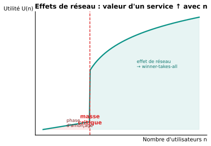

::: {.callout-tip}
## Ce chapitre en 1 ligne
Le numérique change radicalement la microéconomie : **biens à coût marginal quasi-nul**, **effets de réseau**, **plateformes bifaces** et **économie de partage** → tendance forte au **winner-takes-all** (monopoles « naturels » numériques).
:::

## 1. Caractéristiques du produit dans une économie digitale

| Caractéristique | Conséquence |
|---|---|
| **Coût marginal proche de zéro** | Une copie numérique coûte ~0 → tarification radicalement différente |
| **Non-rival** | Mon usage de Spotify n'empêche pas le tien |
| **Coûts fixes élevés au départ** | Développer une plateforme coûte cher (R&D) — mais une fois faite, dupliquer = gratuit |
| **Personnalisable** | Algorithmes, données → produits adaptés à chacun |

::: {.callout-tip collapse="true"}
## En simple
Produire un nouveau morceau de musique numérique pour un client supplémentaire ne coûte presque rien à Spotify. La structure de coût est : **coût fixe massif** (catalogue, infra) + **coût variable quasi-nul**. C'est l'inverse d'une boulangerie où chaque pain coûte de la farine.
:::

## 2. Définition du marché des produits digitaux

Délimiter un marché numérique est **complexe** :

- **Frontières floues** : un téléphone est-il en concurrence avec un appareil photo, une console, un ordinateur ?
- **Multi-faces** : Uber a deux marchés (chauffeurs + passagers) liés.
- **Effets transversaux** : Amazon est e-commerce + cloud (AWS) + streaming + …

→ Les **autorités de la concurrence** doivent souvent redéfinir leurs critères.

## 3. Nouvelles structures de marché

- **Plateformes** : font se rencontrer offre et demande (Airbnb, Uber, App Store).
- **Écosystèmes** : un acteur dominant + de nombreux partenaires (Apple, Google).
- **Marchés bifaces** : deux groupes d'utilisateurs reliés (annonceurs ↔ utilisateurs sur Google).
- **Concurrence pour le marché** plutôt que **sur le marché** : on ne se bat pas pour une part de marché, on se bat pour devenir LE marché.

## 4. Caractéristiques de la demande

| Caractéristique | Description |
|---|---|
| **Coûts de transaction faibles** | Achat en 1 clic → demande plus élastique sur le prix |
| **Comparaison facilitée** | Sites comparateurs → moins de friction |
| **Coûts de basculement (switching costs)** | Une fois sur iOS, passer à Android coûte cher (apps, photos, contacts…) |
| **Lock-in** | Habitudes, données accumulées, intégration |

## 5. Caractéristiques de l'offre

- **Économies d'échelle énormes** : coût moyen qui tend vers 0 quand n grandit.
- **Économies de gamme** : la même infra sert plusieurs produits (Amazon vend tout).
- **Données = nouvel actif** : plus on a d'utilisateurs, plus on a de données, mieux on optimise → cercle vertueux.

## 6. Effets de réseau

**Définition :** la **valeur** d'un service pour un utilisateur **augmente avec le nombre total d'utilisateurs**.

{width=80%}

### Types d'effets de réseau

| Type | Définition | Exemple |
|---|---|---|
| **Direct** | Plus d'utilisateurs = plus utile pour chaque utilisateur | WhatsApp, téléphone |
| **Indirect** | Plus d'utilisateurs d'un côté = plus utile pour l'autre côté | App Store (plus d'apps si plus de users iOS) |
| **De données** | Plus d'utilisateurs = meilleures données = meilleur service | Google, Netflix |
| **Local** | Effet limité à un groupe (ville, langue) | Tinder, Le Bon Coin |

### Conséquence : winner-takes-all

Une fois la **masse critique** atteinte, le service domine. Il est très difficile pour un concurrent d'arriver — même un produit meilleur peut échouer faute d'utilisateurs.

::: {.callout-warning}
## Les fameux « monopoles naturels du numérique »
GAFAM : Google (search), Amazon (e-commerce), Facebook/Meta (social), Apple/Android (smartphones), Microsoft (OS). Tous bénéficient d'effets de réseau massifs → positions dominantes très durables.

D'où les enquêtes antitrust contre Google, Meta, Apple ces dernières années.
:::

## 7. L'économie de partage

**Définition :** plateforme qui permet à des particuliers de **louer ou partager** des biens / services sous-utilisés.

| Exemple | Ce qui est partagé |
|---|---|
| Airbnb | Logement |
| Uber, BlaBlaCar | Trajet en voiture |
| TaskRabbit | Travail à la tâche |
| Vinted, eBay | Biens d'occasion |

### Effets économiques

| Avantage | Inconvénient |
|---|---|
| Meilleure **utilisation des biens** sous-utilisés | **Précarisation** des travailleurs (statut indépendant, pas de sécurité sociale) |
| **Réduction des coûts** pour les consommateurs | Concurrence **déloyale** envers les acteurs traditionnels (hôtels, taxis) |
| **Création de nouveaux marchés** | **Externalités** négatives (Airbnb fait monter les loyers) |
| **Émergence d'une réputation** (notation) | **Asymétrie** : la plateforme fixe les règles |

::: {.callout-tip collapse="true"}
## En simple
L'économie de partage transforme des **biens dormants** (ta voiture garée 95 % du temps, ta chambre d'amis vide) en **revenus**. C'est efficace mais ça déstabilise les marchés existants (taxis, hôtels) et crée des questions sociales (statut des chauffeurs Uber, hausse des loyers à cause d'Airbnb).
:::

## Lien avec les chapitres précédents

| Concept du cours | Apparition dans l'économie digitale |
|---|---|
| Monopole naturel | Plateformes dominantes avec effets de réseau |
| Discrimination par les prix | Tarification personnalisée (algos, A/B tests) |
| Bien public | Wikipédia, logiciels libres |
| Externalités | Réseau social = externalité positive ; effets de mode négatifs |
| Asymétrie d'information | Notes / reviews comme mécanisme |
| Théorie des jeux | Plateformes bifaces, signaux, équilibres multiples |

::: {.callout-note}
## Récapitulatif Ch.7
- Coût marginal ≈ 0 + coûts fixes élevés → tarification radicale, tendance au winner-takes-all.
- **Effets de réseau** (direct, indirect, données, local) → masse critique à franchir.
- **Plateformes bifaces / écosystèmes** : nouvelles structures.
- **Économie de partage** : utilisation des biens sous-utilisés, mais précarisation et externalités.
- Tendance à des **monopoles « naturels » numériques** (GAFAM) → enjeu de régulation.
:::
